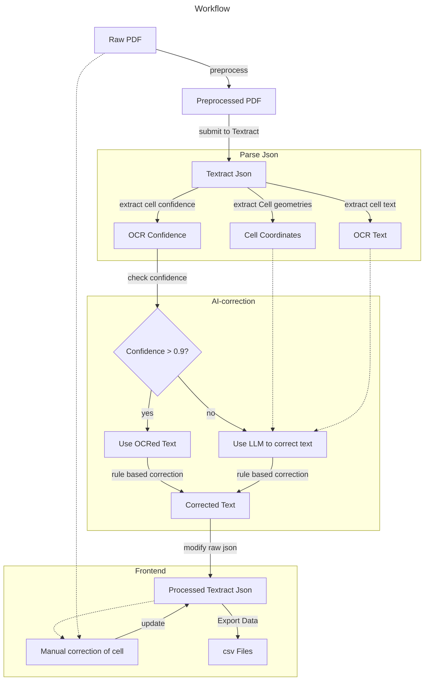

# pdf2tables

# Repository Structure

data/
    raw_pdf/
    preprocessed_pdf/
    raw_textract_json/
    processed_textract_json/
    export_csv/

preprocessing_utils.py
preprocessing.ipynb
textract-utils.py
textract.ipynb
ai_correction_utils.py
ai_correction.ipynb

app.py
assets/
    dashAgGridComponentFunctions.js

pyproject.toml
poetry.lock

# Workflow
